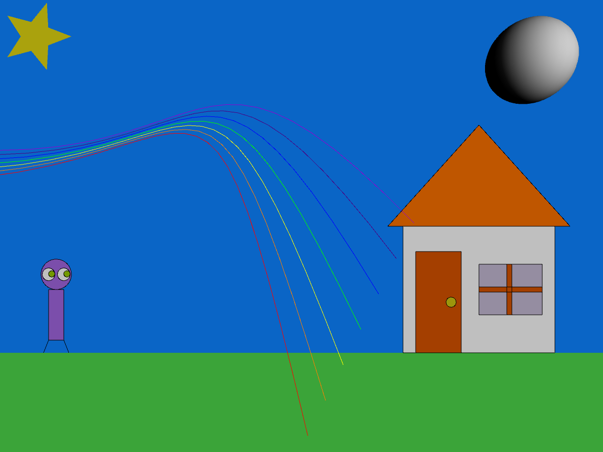

# Projeto de Computação Gráfica

Projeto de Processing para a cadeira de Computação Gráfica 2023.1 da UNICAP. O projeto consiste em uma cena com vários elementos interativos através do mouse e teclado, bem como elementos 2D e 3D.

## Recursos

- Cores personalizáveis
- Velocidade do personagem personalizável
- Modos 'colorido' e 'normal' para o arco-íris

## Uso

- Use as teclas de seta esquerda e direita para mover a pessoa na cena.
- A tecla 'g' começa a fazer a estrela girar e a 'p' a faz parar
- Mova o mouse e veja a luz da lua e os olhos do personagem o seguindo

## Instalação

1. Certifique-se de ter o [Processing](https://processing.org/) instalado em sua máquina.
2. Clone este repositório ou baixe os arquivos do código.
3. Abra o código no Processing.
4. Execute o sketch clicando no botão "Play" ou pressionando Ctrl+R (Cmd+R no Mac).

## Explicação do Código

O código consiste em várias classes e métodos que representam diferentes elementos da animação e são responsáveis por desenha-los e animá-los. São elas:

- Métodos:
  - drawGrass
  - drawMoon
- Classes:
  - House
  - Person
    - Eye
  - Star
  - Rainbow

### Curiosidades

O arco-íris está sendo desenhado utilizando uma curva de Bézier, sendo caracterizada por seus pontos de controle. É passado na função os pontos iniciais e finais da curva, que devem ser atingidos, como os primeiros e últimos parâmetros, respectivamente. Os pontos do meio não são atingidos, mas servem para controlar o formato da curva.

## Alunos

- Igor Freire
- Gabriel Spencer
- Raí Soares
- Rodrigo Cavalcanti
- Talia Flor
